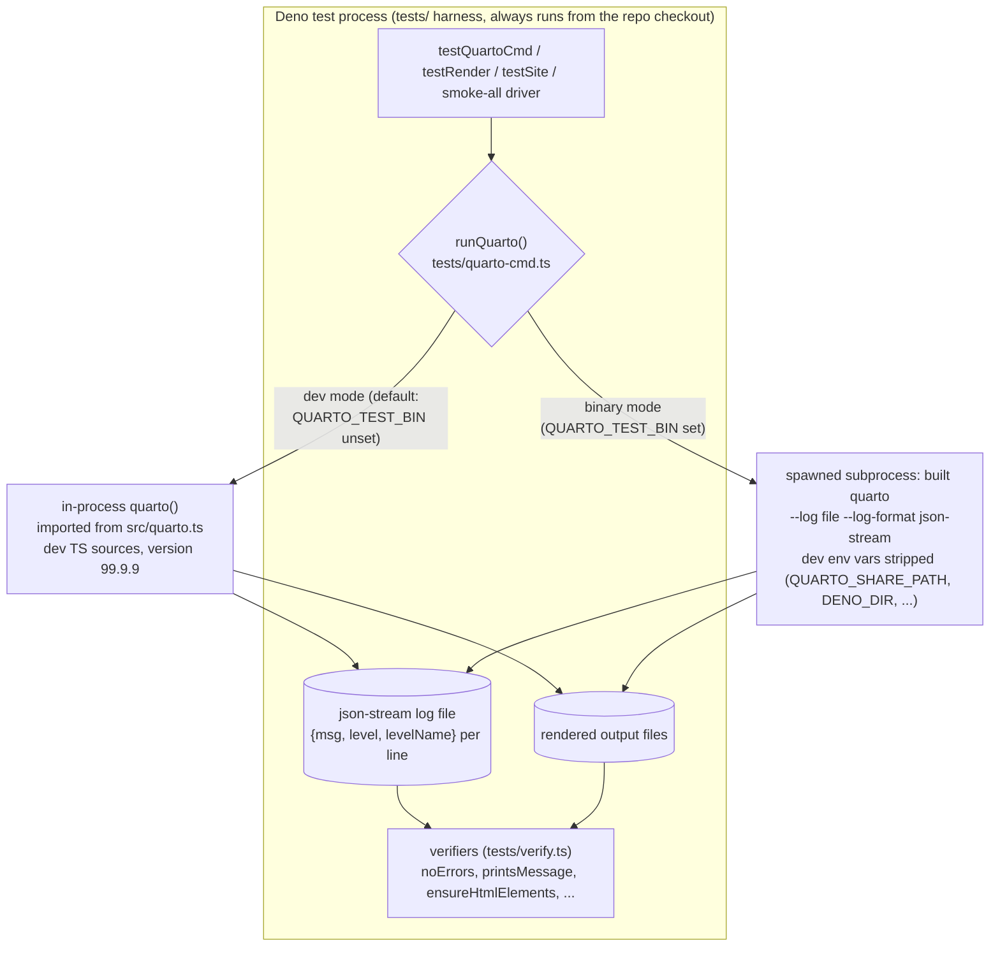
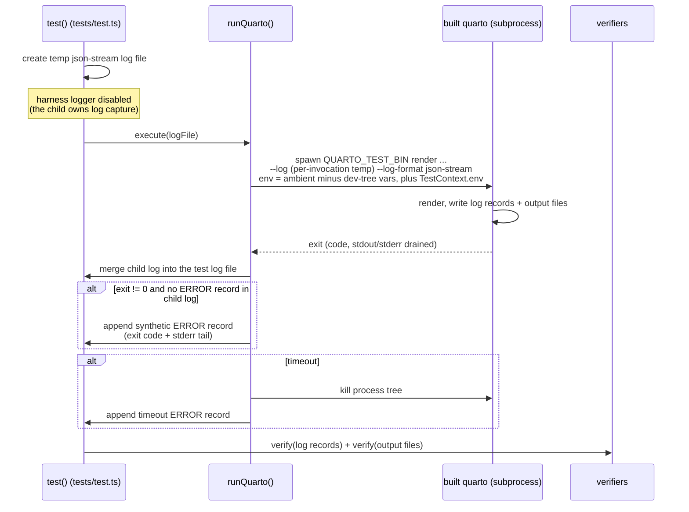
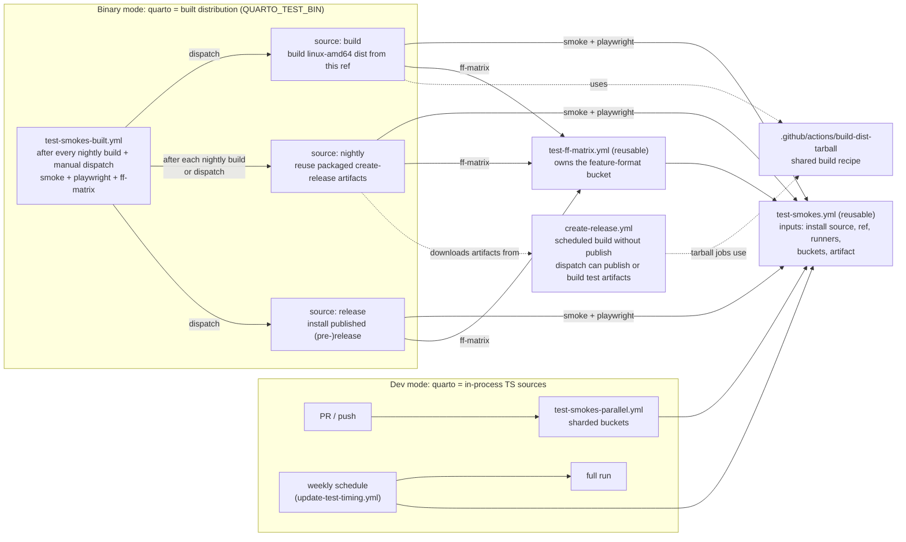
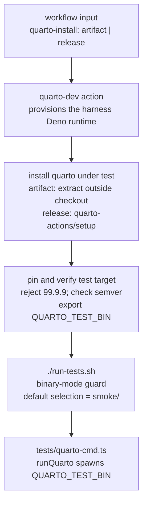

# Built-Version Testing Architecture

This document explains how the test suite runs against a **built** Quarto distribution (binary mode) and records the design decisions behind the test harness and CI wiring.

Document map:

- **This doc** — architecture summary, flow diagrams, and design decisions.
- `tests/README.md` → "Binary mode" — local commands and authoring rules.
- `llm-docs/testing-patterns.md` → "Dev Mode vs Binary Mode" — authoring patterns for tests that must work in both modes.

## Architecture in one paragraph

Every `testQuartoCmd()` test invokes Quarto through `runQuarto()` in `tests/quarto-cmd.ts`.
Dev mode calls the in-process `quarto()` entry point from `src/quarto.ts`.
Binary mode spawns the executable in `QUARTO_TEST_BIN`, merges its JSON-stream log into the test log, and uses the same verifiers.

In CI, `test-smokes.yml` accepts dev, release, or artifact install sources.
`test-smokes-built.yml` resolves build, nightly, and release sources, then schedules smoke, Playwright, and feature-format legs.

## Flow diagrams

### Test invocation

Every `testQuartoCmd()`-based test goes through `runQuarto()`.
Verifiers read the same log records and rendered outputs in both modes.

### Binary-mode test lifecycle

### CI workflow

### `QUARTO_TEST_BIN` propagation in CI

The "Pin and verify test target" step in `test-smokes.yml` computes `QUARTO_TEST_BIN` and exports it through `$GITHUB_ENV`.
Dev-mode callers skip the install and pin steps.

## When to use which mode

| Mode                    | Quarto under test                                                                                                                              | Trigger                             | Suites (legs)                                                                  | Question answered                                                                             |
| ----------------------- | ---------------------------------------------------------------------------------------------------------------------------------------------- | ----------------------------------- | ------------------------------------------------------------------------------ | --------------------------------------------------------------------------------------------- |
| dev (`test-smokes.yml`) | in-process TS sources (99.9.9)                                                                                                                 | every PR/push (sharded); weekly cron via `update-test-timing.yml` (full run, timing file only) | everything (sharded per-commit; ff-matrix via its own cron/push/PR)            | did this code change break behavior?                                                          |
| nightly                 | packaged nightly artifacts (Linux tarball, real `quarto.exe`, notarized Mac zip); Windows signing is skipped on the *scheduled* build, see D11 | automatic, after each nightly build | smoke (linux+windows+mac) + playwright (linux+mac) + ff-matrix (linux+windows) | does what we *ship* work? (bundling/packaging/launcher bugs; only macOS smoke coverage in CI) |
| build                   | fresh linux-amd64 dist from the current ref (unsigned)                                                                                         | manual dispatch                     | smoke + playwright + ff-matrix (all linux)                                     | does this ref work when packaged? (works on forks/PR branches)                                |
| release                 | published (pre-)release via quarto-actions/setup, harness at its `v` tag                                                                       | manual dispatch                     | smoke (linux+windows) + playwright (linux) + ff-matrix (linux+windows)         | does the published version pass?                                                              |

Dev mode covers unit tests, dev-only paths, and in-process behavior. Built modes cover the packaged product.
The non-Playwright integration tests remain in the dev shards.

In practice:

- `nightly` runs automatically after each nightly build and tests the available packaged binaries.
  Scheduled builds skip Windows signing (D11).
- Dispatch `build` for immediate Linux feedback on packaging or harness changes.
- For signed Windows artifacts from a branch, dispatch `create-release` with `publish-release=false` and `smoke-artifacts-only=true`. The resulting workflow run starts the available test legs automatically (D7).
- Dispatch `nightly` with a `run-id` to retest an earlier `create-release` run.
- Dispatch `release` for post-publish verification, such as the optional prerelease checklist step.
  It works only for releases cut after the harness support merged (D10).

## Built-mode test legs (scheduler layout)

`test-smokes-built.yml` = a `resolve-mode` job computing the source mode once (`needs.resolve-mode.outputs.mode`, gating all other jobs) + the mode **resolvers** (build-artifact / resolve-nightly / resolve-release) + a **scheduler**: per-leg caller jobs fanning out to the reusable workflows.
Each source mode schedules three independent legs:

| leg        | goes through                    | bucket                                                  | OS scope                                                                             |
| ---------- | ------------------------------- | ------------------------------------------------------- | ------------------------------------------------------------------------------------ |
| smoke      | `test-smokes.yml`               | `inputs.buckets` (empty = binary-mode `smoke/` default) | build: linux; nightly: linux+windows+mac (`has-*` gated); release: linux+windows     |
| playwright | `test-smokes.yml`               | `["integration/playwright-tests.test.ts"]`              | linux (+ mac on nightly) — **never windows**, see below                              |
| ff-matrix  | `test-ff-matrix.yml` (reusable) | owned by `test-ff-matrix.yml`                           | linux (+ windows on nightly/release) — no macOS (Julia/TeX toolchain unproven there) |

Key points:

- **Smoke is also the general bucket runner.** When a manual dispatch sets `buckets`, only smoke jobs run. The Playwright and feature-format jobs require an empty `buckets` input.
- **Windows has no Playwright leg.** `playwright-tests.test.ts` ignores browser assertions on Windows CI. Before adding this leg, update that gate and the report-upload gate in `test-smokes.yml`.
- **Playwright renders need a sanitized environment.** Calls through `execProcess` and `quartoDevCmd()` must pass `quartoSpawnEnvOptions()` so built Quarto does not inherit dev-tree paths.
- **Playwright reports include the OS in their artifact names.** Sibling jobs share a workflow run and cannot upload artifacts with the same name.
- **Scheduler jobs own OS scope.** Set it through their `runners` inputs.

### `test-ff-matrix.yml` is reusable (`workflow_call`)

The feature-format bucket glob (`../dev-docs/feature-format-matrix/qmd-files/**/*.qmd`) is defined only in `test-ff-matrix.yml`.
Built-mode callers use its `workflow_call` trigger, while its existing dev triggers remain.
The workflow forwards install, artifact, ref, runner, R-package, and `label-tag` inputs to `test-smokes.yml`, with dev defaults for non-call triggers.
The tag defaults to `ffdev` for standalone dev triggers and distinguishes same-OS jobs in the shared failure summary.

Reusable-workflow concurrency is evaluated in the caller's context. The group therefore includes a suffix based on `inputs.runners` and `github.run_id`, preventing sibling feature-format legs from canceling one another.
Dev triggers use a constant `-dev` suffix.
The workflow does not declare `permissions`, so it inherits the caller's `actions: write` permission for Julia cache cleanup.

## Design decisions

Each entry: what was decided, why, and what would justify revisiting.

### D1. Nightly wiring: `workflow_run`, not `workflow_call`/dispatch/inversion

**Decision.** `test-smokes-built.yml` listens for completed "Build Installers" (`create-release.yml`) runs via `workflow_run` and reuses their artifacts cross-run (`quarto-artifact-run-id`).
The release pipeline is not modified for testing purposes.

**Alternatives considered (2026-07, maintainer question):**

- *Dispatch tests from create-release* — adds permissions and dispatch code to the release workflow without avoiding the default-branch constraint.
- *Call `test-smokes.yml` from create-release* — simplifies artifact access, but test failures would mark release builds as failed and test configuration would move into the release workflow.
- *Let `test-smokes-built` call create-release* — still requires the full daily build, couples nightly builds to test-workflow availability, and moves them out of the "Build Installers" history.

**Rationale:** `workflow_run` keeps release and test status separate without adding test orchestration to the release workflow.

**Known weaknesses:** the trigger depends on the workflow display name (`workflows: ["Build Installers"]`), so renaming the workflow stops the trigger. GitHub does not report a missing trigger as a failure.
The trigger fires after every completed create-release run, including manual and partial builds. Each OS leg therefore checks that its artifact exists.

A dispatch can opt out per-run via `skip-auto-smoke` (see D7.1) when it does not need the downstream suite.

**Revisit when:** maintainers want a single nightly build-and-test status and are willing to couple the workflows.

### D2. Version marker: semver *build metadata* (`X.Y.Z+test.YYYYMMDD`)

Built test distributions use `$(cat version.txt)+test.$(date +%Y%m%d)`.
Do not use a prerelease suffix, which fails plain `>=X.Y` `quarto-required` ranges, or a fourth numeric component, which is invalid semver.
Build metadata preserves range comparisons while distinguishing the build from the `99.9.9` dev version.
Lua filters see the marker stripped: `init.lua` normalizes the `quarto-version` param to its leading dotted-numeric component, so `quarto.version` is `X.Y.Z` while `quarto --version` reports the full stamp.
The marker is therefore observable through the CLI, not through `quarto.version`.

### D3. Dist outside the checkout + `99.9.9` sentinel refusal

Installed launchers detect dev mode via a sibling `src/quarto.ts`: an in-repo `package/dist/bin/quarto` silently runs the TS sources instead of the built code.
Therefore the dist under test must be extracted *outside* the repo, and both `run-tests.[sh|ps1]` and `assertTestBinary()` refuse a binary reporting `99.9.9` (`kLocalDevelopment`).
CI extracts artifacts to `RUNNER_TEMP`.

### D4. Child env: inherit ambient + strip dev vars (not clearEnv+allowlist)

Binary-mode spawns inherit the ambient environment minus a strip list, with `TestContext.env` overlaid last.
The list (16 names, `QUARTO_SHARE_PATH`, `QUARTO_BIN_PATH`, `DENO_DIR`, `QUARTO_DEBUG`, `QUARTO_FORCE_VERSION`, ...) lives in one tracked file, `tests/binary-mode-strip-env.txt`, read at runtime by `quarto-cmd.ts`'s `buildBinaryEnv()`/`sanitizeBinaryEnv()` and by the `QUARTO_TEST_BIN` preflight probe in both `run-tests.sh` and `run-tests.ps1` — a single source of truth for what must not leak into a built-binary spawn, at either the probe or every subsequent test command.
A `clearEnv` allowlist was rejected because the required Windows system variables (`SystemRoot`, `PATHEXT`, and others) are difficult to maintain reliably.
The dev-tree exports in `run-tests.[sh|ps1]` are kept in all modes — the *harness* process still needs them; only the *child* is sanitized.
All three readers fail closed (missing/unreadable/empty file, or a malformed entry) rather than silently stripping nothing.
No CI check exercises the strip list's actual *effect*: the `--version` probe in `run-tests.[sh|ps1]` and `assertTestBinary()` is served by a launcher-level shortcut (`package/scripts/common/quarto`, `package/scripts/windows/quarto.cmd`) that prints the version and exits without invoking Deno at all, so no environment variable — including `QUARTO_VERSION_REQUIREMENT` — can ever change that probe's outcome. A CI guard built on setting `QUARTO_VERSION_REQUIREMENT` and expecting the probe to fail (or keep succeeding) was considered and dropped for this reason; it would have been dead code regardless of whether a reader correctly stripped the variable.

### D5. Silent-green guard: synthetic ERROR records

Some failures exit without an error log record, including pre-logger failures and command passthroughs. Many smoke-all documents rely only on log verification.
When a failed child has no error record, `runQuarto()` appends one with the exit code and stderr tail. It also records timeouts after killing the process tree.

### D6. `QUARTO_TEST_BIN` is set at runtime, never declared statically

The "Pin and verify test target" step in `test-smokes.yml` resolves the installed binary, verifies it (sentinel refusal, semver shape, optional `QUARTO_TEST_EXPECTED_VERSION` match), and exports it via `$GITHUB_ENV` so every later step — including the unchanged `run-tests.sh` invocation — sees it.
These steps are skipped when `quarto-install` is `dev`.

### D7. `smoke-artifacts-only` is for partial branch builds

This `create-release.yml` input omits source and arm64 tarballs, Linux installers, and the Mac build.
For a branch build, dispatch create-release with `publish-release=false` and `smoke-artifacts-only=true`; the `workflow_run` trigger tests the artifacts.
The configure job rejects this mode when publishing is enabled, and partial builds use a per-run concurrency group.
The daily path still uses the full build because the Mac zip provides macOS smoke coverage.

### D7.1 `skip-auto-smoke` opts a dispatch out of the auto-triggered suite

`create-release.yml`'s `workflow_dispatch` has a `skip-auto-smoke` boolean input (default `false`). The Runs API does not expose `workflow_dispatch` inputs on a completed run (verified live via `gh api repos/quarto-dev/quarto-cli/actions/runs/RUNID` — no `inputs` field), so `test-smokes-built.yml`'s `resolve-nightly` job cannot read the flag off `github.event.workflow_run` directly.

**Mechanism: the run title.** `create-release.yml` sets `run-name: "Build Installers${{ inputs.skip-auto-smoke && ' [skip-auto-smoke]' || '' }}"`. GitHub evaluates `run-name` from the dispatch inputs when the run is created, and the `completed` `workflow_run` payload carries the result as `github.event.workflow_run.display_title`. `resolve-nightly` reads it through a `SKIP_AUTO_SMOKE` env expression — no extra API call — and forces `has-linux`/`has-windows`/`has-mac` to `false`. Every nightly leg (smoke, Playwright, ff-matrix, all OSes) then no-ops through its existing `has-* == 'true'` gate, without an error. The build itself is unaffected: this only silences the downstream test fan-out, unlike `smoke-artifacts-only` (D7), which trims what gets built.

Use `inputs.skip-auto-smoke`, not `github.event.inputs.skip-auto-smoke` — the latter yields the string `"false"`, which is truthy. For `schedule` runs `inputs` is empty, so the expression renders the plain `Build Installers` title, byte-identical to the pre-change default.

**Why not a marker artifact.** Uploading an empty `skip-smoke` artifact also works and was implemented first, but it costs an upload step on every skipped build and leaves a stray artifact for the full retention period — which would also suppress a later *manual* `source=nightly` dispatch aimed at that run id, silently. The title is metadata-to-metadata and scoped to the event.

**Scope: only the automatic path.** `SKIP_AUTO_SMOKE` is gated on `github.event_name == 'workflow_run'`, so a manual `test-smokes-built.yml` dispatch with `source=nightly` and an explicit `run-id` still tests that build. An explicit request to test a run outranks the upstream dispatcher's "do not auto-test me".

**Why this does not break the `workflow_run` trigger.** The `workflows: ["Build Installers"]` filter matches the workflow's `name:`, not its `run-name`; the two are separate objects in the payload (`workflow.name` vs `workflow_run.name`). Verified against the reproduction repo for actions/runner#4141, where a workflow carrying a custom `run-name` still fires its `workflow_run` listener on both `requested` and `completed`. Related open bug worth knowing: actions/runner#4141 reports that on `completed`, `workflow_run.name` is *also* overwritten with the run-name. We key on `display_title`, which is the field GitHub documents for this purpose and which the proposed fix preserves. Note also that at `types: [requested]` the payload's `display_title` is the workflow name, not the run-name — harmless here because this trigger uses `types: [completed]`, and the check fails open (tests run) if that ever changes.

Independent of a separately-tracked `branches:[main]` filter on the same `workflow_run` trigger: that gate narrows by branch, this narrows by explicit per-dispatch choice, regardless of branch.

### D8. macOS runners: scheduled/built runs only, never per-commit

`test-smokes-parallel.yml` (per-commit) must stay fast, so it never passes `runners` and keeps the `ubuntu-latest`/`windows-latest` default.
The only `macos-latest` smoke job is the nightly Mac leg in `test-smokes-built.yml`.
Encoded in the `runners` input description in `test-smokes.yml`.

### D9. Built mode runs smoke + playwright + ff-matrix daily; the dev crons stay

Built mode runs smoke, Playwright (`integration/playwright-tests.test.ts`), and the feature-format matrix.
The test-script default previously excluded the latter two; the harness now supports both.

What stays dev-only: `unit/` (in-process by definition), the non-playwright `integration/` tests (`guess-chunk-options-format-document.test.ts`, `mermaid/github-issue-1340.test.ts` — dev shards only), `QUARTO_DEBUG` paths, the `quarto check` dev branch, and in-process races.
The julia-engine subtree tests are temporarily dev-only. Their direct Quarto subprocesses inherit dev-tree variables, so `merge-extension-tests` skips them in binary mode until the upstream spawns are sanitized.

Remaining built-mode gaps are preview and serve paths, publishing, installer behavior, Linux arm64, and Playwright visual snapshots.
Windows browser behavior and macOS feature-format coverage are also excluded as described in "Built-mode test legs".
Dev schedules remain because they test source behavior, while built schedules test packaged behavior.
All built legs currently run after every completed `create-release` run, unless the triggering dispatch set `skip-auto-smoke` (D7.1). If CI cost becomes excessive, gate heavy legs on scheduled runs.

### D10. Release mode only works for post-harness tags

Release mode checks out the tag, so the harness at that tag must already contain `tests/quarto-cmd.ts` — a preflight fails clearly for older releases.
Testing an older binary with the current harness would require decoupling the harness from the target ref.

Nightly and release legs use the harness from the target ref. Refs that contain `tests/quarto-cmd.ts` but predate the `quartoSpawnEnvOptions()` fix in `playwright-tests.test.ts` (#14706) run Playwright with dev-tree resources.
The preflight cannot detect this window. Smoke and feature-format legs are unaffected because their subprocesses use `runQuarto()`.

### D11. The automatic nightly leg tests an *unsigned* `quarto.exe`

`create-release.yml` gates both DigiCert steps ("Sign files before making ZIP and MSI installer", "Sign MSI installer") on `github.event_name != 'schedule'`, so the daily scheduled build — the one `workflow_run` fires on every night — packages an unsigned `quarto.exe` into `Windows Zip`.
macOS is unaffected: `make-installer-mac` signs and notarizes on every event.

This is sufficient for the packaging and launcher checks in binary mode.
The daily run exercises the real launcher (`package/launcher` `quarto.exe`) rather than the dev `.cmd` shim.
Signing changes the bytes, not the launcher's argument handling or resource resolution.

Signed Windows coverage comes from dispatched `create-release` runs, which `workflow_run` also tests (D7). The scheduled path does not validate signing.
