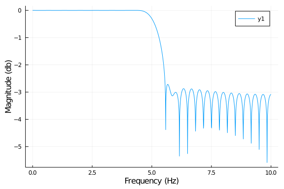
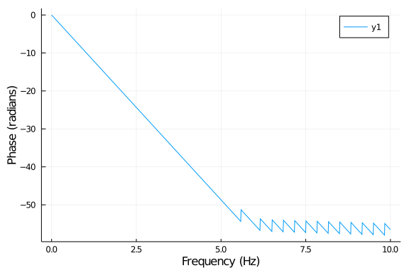

# Introduction

This an example of a julia script that can be published using
[Weave](http://weavejl.mpastell.com/dev/usage/).
The script can be executed normally using Julia
or published to HTML or pdf with Weave.
Text is written in markdown in lines starting with "`#'` " and code
is executed and results are included in the published document.

Notice that you don't need to define chunk options, but you can using
`#+`. just before code e.g. `#+ term=True, caption='Fancy plots.'`.
If you're viewing the published version have a look at the
[source](FIR_design_plots.jl) to see the markup.

<!-- this setup dependencies, but doesn't appear in the generated document -->

# FIR Filter Design

We'll implement lowpass, highpass and ' bandpass FIR filters. If
you want to read more about DSP I highly recommend [The Scientist
and Engineer's Guide to Digital Signal
Processing](http://www.dspguide.com/) which is freely available
online.

## Calculating frequency response

DSP.jl package doesn't (yet) have a method to calculate the
the frequency response of a FIR filter so we define it:

~~~~{.julia}
using Plots, DSP
gr()

function FIRfreqz(b::Array, w = range(0, stop=π, length=1024))
    n = length(w)
    h = Array{ComplexF32}(undef, n)
    sw = 0
    for i = 1:n
      for j = 1:length(b)
        sw += b[j]*exp(-im*w[i])^-j
      end
      h[i] = sw
      sw = 0
    end
    return h
end
~~~~~~~~~~~~~

~~~~
FIRfreqz (generic function with 2 methods)
~~~~

## Design Lowpass FIR filter

Designing a lowpass FIR filter is very simple to do with DSP.jl, all you
need to do is to define the window length, cut off frequency and the
window. We will define a lowpass filter with cut off frequency at 5Hz for a signal
sampled at 20 Hz.
We will use the Hamming window, which is defined as:
$w(n) = \alpha - \beta\cos\frac{2\pi n}{N-1}$, where $\alpha=0.54$ and $\beta=0.46$

~~~~{.julia}
fs = 20
f = digitalfilter(Lowpass(5, fs = fs), FIRWindow(hamming(61)))
w = range(0, stop=pi, length=1024)
h = FIRfreqz(f, w)
~~~~~~~~~~~~~

~~~~
1024-element Array{Complex{Float32},1}:
           1.0f0 + 0.0f0im
    0.99546844f0 + 0.095055714f0im
    0.98191506f0 + 0.1892486f0im
    0.95946306f0 + 0.28172377f0im
     0.9283168f0 + 0.37164196f0im
     0.8887594f0 + 0.45818728f0im
    0.84115064f0 + 0.54057467f0im
     0.7859234f0 + 0.618057f0im
    0.72357976f0 + 0.6899319f0im
    0.65468615f0 + 0.7555481f0im
                 ⋮
 0.00043952762f0 - 0.00041908873f0im
  0.0005152718f0 - 0.00040521423f0im
  0.0005873293f0 - 0.00037745363f0im
  0.0006531789f0 - 0.0003367371f0im
  0.0007105166f0 - 0.00028444792f0im
  0.0007573364f0 - 0.00022237403f0im
  0.0007920005f0 - 0.00015264557f0im
  0.0008132961f0 - 7.766036f-5im
  0.0008204784f0 - 3.1148685f-18im
~~~~

## Plot the frequency and impulse response

The next code chunk is executed in term mode, see the [script](FIR_design.jl) for syntax.

~~~~{.julia}
julia> h_db = log10.(abs.(h));

julia> ws = w/pi*(fs/2)
0.0:0.009775171065493646:10.0
~~~~~~~~~~~~~

~~~~{.julia}
plot(ws, h_db,
      xlabel = "Frequency (Hz)", ylabel = "Magnitude (db)")
~~~~~~~~~~~~~

\ 

And again with default options

~~~~{.julia}
h_phase = unwrap(-atan.(imag.(h),real.(h)))
plot(ws, h_phase,
    xlabel = "Frequency (Hz)", ylabel = "Phase (radians)")
~~~~~~~~~~~~~

\ 

