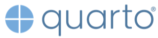

This tests shift control on margin figures.

Line 1 with a fixed figure:

{#fig-fixed .column-margin shift="false" width=100%}

Line 2 with an avoid figure:

{#fig-avoid .column-margin shift="avoid" width=100%}

The first figure stays fixed, the second only shifts if necessary.
